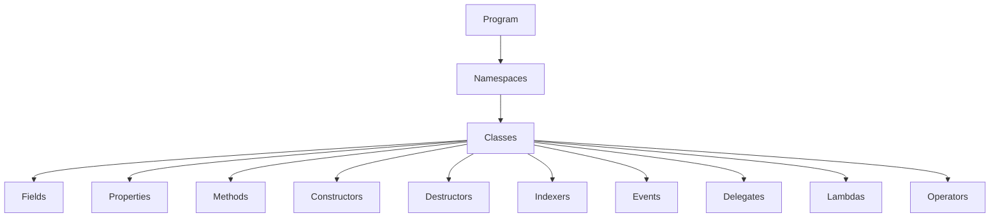

C# (pronounced "See Sharp") is a modern, object-oriented, and type-safe programming language created by Microsoft that runs on the .NET platform. C# has roots from the C family of languages and is close to other popular languages like C++, Java, and JavaScript. The first version of C# was released in 2002. The latest version, C# 11, was released in November 2022. 

C# is used for:

- Mobile applications
- Desktop applications
- Web applications
- Web services
- Web sites
- Games
- VR
- Database applications
- And much, much more!

## Why use C#?

- It is one of the most popular programming languages in the world
- It is easy to learn and simple to use
- It has a huge community support
- C# is an object-oriented language which gives a clear structure to programs and allows code to be reused, lowering development costs
- As C# is close to C, C++, and Java, it makes it easy for programmers to switch to C# or vice versa

## How to get started with C#?

This tutorial will teach you the basics of C#. It is not necessary to have any prior programming experience. You can try these tutorials in different environments. The concepts you'll learn are the same. The difference is which experience you prefer:

- In your browser, on the docs platform: This experience embeds a runnable C# code window in docs pages. You write and execute C# code in the browser.
- In the Microsoft Learn training experience: This learning path contains several modules that teach the basics of C#. You can also earn badges and certificates as you progress.
- In Jupyter on Binder: You can experiment with C# code in a Jupyter notebook on binder.
- On your local machine: After you've explored online, you can download the .NET SDK and build programs on your machine.

## Compare the Features of C# With Other Languages

| Feature | C# | C++ | Java | JavaScript |
|---------|----|-----|------|------------|
| Object-oriented | Yes | Yes | Yes | Yes |
| Type-safe | Yes | No | Yes | No |
| Garbage-collected | Yes | No | Yes | Yes |
| Delegates and events | Yes | No | No | No |
| Generics | Yes | Yes (templates) | Yes | No |
| LINQ | Yes | No | No | No |
| Async and await | Yes | No (coroutines) | No (completable futures) | Yes |
| String interpolation | Yes | No (format) | No (format) | Yes (template literals) |
| Nullable types | Yes (reference and value types) | No (pointers) | No (reference types only)  | No (undefined and null) |
| Dynamic typing | Yes (dynamic keyword)  | No  | No  | Yes  |

Here is a possible diagram for the structure of a C# program:

