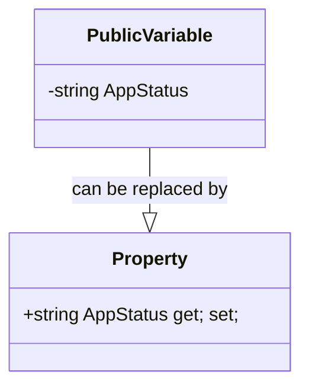

Sure, I can write about a different best practice in .NET C#. Here is a possible markdown output:

## Use Properties instead of Public Variables

Properties are a way of exposing data members of a class or struct to the outside world. Properties provide a level of abstraction and encapsulation that public variables do not. Properties allow you to control the access and modification of the data members, and to implement logic or validation when setting or getting the values.

There are several benefits of using properties instead of public variables:

- Properties can have different access modifiers for the get and set accessors, allowing you to make the property read-only or write-only for external callers.
- Properties can be virtual, abstract, or override, enabling polymorphism and inheritance scenarios.
- Properties can be interface members, allowing you to define contracts for your classes or structs.
- Properties can be data-bound, enabling scenarios such as data binding in Windows Forms or WPF applications.
- Properties can trigger events, such as PropertyChanged or CollectionChanged, notifying subscribers of any changes in the property value.
- Properties can use attributes, such as [DataMember] or [Required], providing metadata for serialization or validation.

Here is an example of using a property instead of a public variable:

```csharp
public class AppNotification
{
    // A public variable, this should be avoided
    // public string AppStatus;

    // A property, this is preferred
    public string AppStatus { get; set; }
}
```


Here is a table that summarizes the benefits of using properties instead of public variables:

| Benefit | Public variable | Property |
| ------- | --------------- | -------- |
| Access control | No | Yes |
| Polymorphism | No | Yes |
| Interface implementation | No | Yes |
| Data binding | No | Yes |
| Event triggering | No | Yes |
| Attribute usage | No | Yes |

Sure, I can make the diagram use mermaid. Here is the mermaid code for the diagram:

