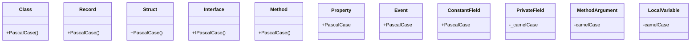

## Use Proper Naming Conventions

Naming conventions are important for creating consistent and readable code. They help developers to understand the purpose and meaning of different elements in the code, such as classes, methods, properties, variables, and constants. They also help to avoid naming conflicts and confusion.

There are several naming conventions to consider when writing C# code. For example:

- Use Pascal case (\"PascalCasing\") when naming a class, record, struct, interface, method, property, event, or constant field. Pascal case means that the first letter of each word in the name is capitalized.
- Use Camel case (\"camelCasing\") when naming a private or internal field, a method argument, or a local variable. Camel case means that the first letter of the first word in the name is lowercase, and the first letter of each subsequent word is capitalized.
- Prefix interface names with an I to indicate that they are interfaces. For example: `public interface IWorkerQueue`.
- Prefix private or internal fields with an _ to indicate that they are not public. For example: `private IWorkerQueue _workerQueue`.
- Use descriptive and meaningful names that convey the intent and functionality of the code element. Avoid using abbreviations, acronyms, or single-letter names that are not clear or obvious. For example: `public class AppNotification` is better than `public class AN`.

Following these naming conventions can make your code more consistent, readable, understandable, and maintainable.

Pascal case is preferred over camel case for public elements because it follows the .NET Framework Design Guidelines, which are widely adopted by the C# community. Pascal case also helps to distinguish public elements from private or internal elements, which use camel case. This can make the code more clear and consistent, and can help with statement completion in IDEs that support it.

You're welcome. I can make the diagram more colorful by adding some style tags to the mermaid code. Here is the updated mermaid code for the diagram:


-----------------

Here is a table that summarizes the naming conventions for different code elements:

| Code element | Naming convention | Example |
| ------------ | ----------------- | ------- |
| Class | Pascal case | `public class AppNotification` |
| Record | Pascal case | `public record PhysicalAddress` |
| Struct | Pascal case | `public struct ValueCoordinate` |
| Interface | Pascal case with I prefix | `public interface IWorkerQueue` |
| Method | Pascal case | `public void SendNotification()` |
| Property | Pascal case | `public string AppStatus { get; set; }` |
| Event | Pascal case | `public event Action EventProcessing` |
| Constant field | Pascal case | `public const string ConstantFieldNamingConvention = "C#"` |
| Private or internal field | Camel case with _ prefix | `private IWorkerQueue _workerQueue` |
| Method argument | Camel case | `public void MethodNamingConvention(string methodArgsNamingConvention)` |
| Local variable | Camel case | `string localVariables = "string here ..."` |

-------------------

### Code

Here is a code snippet that demonstrates the naming conventions for different code elements:

```csharp
namespace ExampleApp
{
    // Class name in Pascal case
    public class AppNotification
    {
        // Constant field name in Pascal case
        public const string ConstantFieldNamingConvention = "C#";

        // Private field name in camel case with _ prefix
        private string _appStatus;

        // Property name in Pascal case
        public string AppStatus
        {
            get { return _appStatus; }
            set { _appStatus = value; }
        }

        // Event name in Pascal case
        public event Action EventProcessing;

        // Method name in Pascal case
        public void SendNotification()
        {
            // Local variable name in camel case
            string localVariables = "string here ...";
            // ...
        }
    }

    // Interface name in Pascal case with I prefix
    public interface IWorkerQueue
    {
        // ...
    }

    // Record name in Pascal case
    public record PhysicalAddress(
        string Street,
        string City,
        string StateOrProvince,
        string ZipCode){}

    // Struct name in Pascal case
    public struct ValueCoordinate
    {
        // ...
    }
}
```
