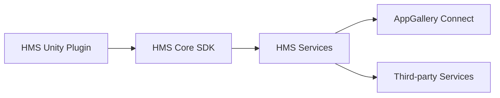
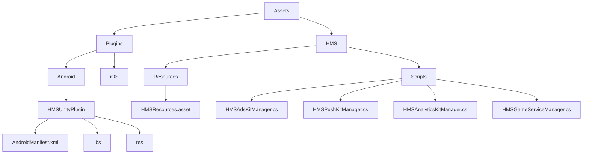

# HMS Unity Plugin Documentation

## Introduction

This documentation will guide you through the steps of integrating the HMS Unity Plugin into your Unity project. The HMS Unity Plugin is a plugin for the Unity game engine that allows developers to integrate the Huawei Mobile Services (HMS) Core SDK into their Unity projects. The plugin provides a set of tools and APIs that enable developers to access the features and services provided by HMS, such as the Ads Kit, Push Kit, Analytics Kit, and more.

By using the HMS Unity Plugin, you can leverage the power of HMS to enhance your game with features such as monetization, user engagement, analytics, and more. You can also reach a wider audience of Huawei and Honor device users who use the Huawei AppGallery as their app store.

The following table summarizes the main features and benefits of each kit that is supported by the HMS Unity Plugin:

| Kit | Features | Benefits |
| --- | --- | --- |
| Ads Kit | -Banner, interstitial, rewarded, and native ads  - Consent management    - Ad configuration | - Monetize your game with various ad formats    - Respect user privacy and preferences    - Optimize ad performance and revenue |
| Push Kit | -Push messages and notifications    - Notification settings    - Custom data | - Increase user engagement and retention    - Customize notification appearance and behavior    - Deliver personalized and relevant content |
| Analytics Kit | -User attributes    - Predefined and custom events    - Predefined and custom reports | - Collect and analyze user behavior data    - Improve game performance and user experience    - Gain insights and make data-driven decisions |
| Game Service | -Huawei ID sign-in    - Achievements    - Leaderboards    - Saved games | - Simplify user authentication and authorization    - Enhance game features and social aspects    - Sync user progress across devices |

The following diagram shows how the HMS Unity Plugin interacts with the HMS Core SDK and the HMS services:

## Prerequisites

Before you start using the HMS Unity Plugin, you need to have the following prerequisites:

- A Huawei ID account
- A Huawei Developer account
- A registered app on AppGallery Connect
- A configured SHA-256 certificate fingerprint for your app
- A downloaded agconnect-services.json file for your app
- A Unity project with a minimum API level of 19 (Android 4.4) or higher
- A downloaded HMS Unity Plugin package

## Installation

To install the HMS Unity Plugin into your Unity project, follow these steps:

1. Open your Unity project and go to Assets > Import Package > Custom Package.
2. Select the HMS Unity Plugin package that you downloaded and click Open.
3. In the Import Unity Package window, make sure all the files are checked and click Import.
4. Wait for the import process to finish and then go to Huawei > Kit Manager.
5. In the Kit Manager window, select the kits that you want to use in your project and click Apply.
6. Wait for the configuration process to finish and then go to Huawei > AGC Manager.
7. In the AGC Manager window, click Browse and select the agconnect-services.json file that you downloaded for your app.
8. Click Apply and wait for the verification process to finish.

The following diagram shows how the HMS Unity Plugin files are organized in your project:

## Usage

To use the HMS Unity Plugin in your project, you need to follow the specific instructions for each kit that you want to use. You can find the detailed documentation for each kit on the [HMS Unity Plugin GitBook](https://evilminddevs.gitbook.io/hms-unity-plugin/). You can also check out the sample projects on the [HMS Unity Plugin GitHub](https://github.com/EvilMindDevs/hms-unity-plugin) for reference.

Here are some general steps that apply to most kits:

1. Add the required permissions and dependencies to your AndroidManifest.xml file. You can use the Huawei > Manifest Manager tool to do this automatically or manually edit the file under Assets > Plugins > Android > HMSUnityPlugin > AndroidManifest.xml.
2. Initialize the kit that you want to use by calling its Init method in your script. For example, if you want to use the Ads Kit, you can call `HMSAdsKitManager.Instance.Init();` in your Start or Awake method.
3. Call the methods of the kit that you want to use in your script according to your needs. For example, if you want to show an interstitial ad using the Ads Kit, you can call `HMSInterstitialAdManager.Instance.ShowInterstitialAd();` in your script when appropriate.
4. Handle the events and callbacks of the kit that you want to use in your script according to your needs. For example, if you want to listen for ad load events using the Ads Kit, you can add listeners to `HMSInterstitialAdManager.Instance.OnInterstitialAdLoaded` and `HMSInterstitialAdManager.Instance.OnInterstitialAdFailedToLoad` in your script.

## Conclusion

This documentation has given you an overview of how to integrate and use the HMS Unity Plugin in your Unity project. You can find more information and examples on each kit on the [HMS Unity Plugin GitBook](https://evilminddevs.gitbook.io/hms-unity-plugin/) and [HMS Unity Plugin GitHub](https://github.com/EvilMindDevs/hms-unity-plugin). You can also join the [HMS Discord Channel](https://discord.gg/5ZbZxGj) for support and feedback.

We hope that this documentation has been helpful and that you enjoy using the HMS Unity Plugin in your game development journey.