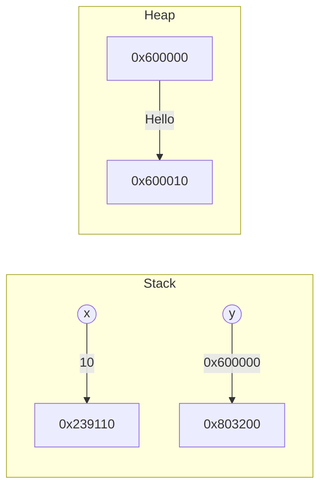

# Basic syntax of C#

C# syntax is based on the C family of languages and is similar to other popular languages like C++, Java, and JavaScript. In this section, we will cover some of the basic elements of C# syntax, such as:

- Comments
- Namespaces
- Classes
- Methods
- Statements
- Variables
- Data types
- Value types and reference types
- Operators and expressions

## Comments

Comments are used to add notes or explanations to the code. Comments are ignored by the compiler and do not affect the execution of the program. There are two types of comments in C#:

- Single-line comments: start with // and end at the end of the line. For example:

```cs
// This is a single-line comment
```

- Multi-line comments: start with /* and end with */ and can span multiple lines. For example:

```cs
/* This is a multi-line comment
   that can span several lines */
```

## Namespaces

Namespaces are used to organize and group related types and code. Namespaces can contain other namespaces, classes, interfaces, structs, enums, and delegates. Namespaces can be declared using the namespace keyword followed by a name. For example:

```cs
namespace HelloWorld
{
  // Namespace content goes here
}
```

Namespaces can be nested inside other namespaces using the dot (.) notation. For example:

```cs
namespace HelloWorld.UI
{
  // Namespace content goes here
}
```

Namespaces can be imported using the using keyword followed by a name. This allows you to use the types and members of that namespace without specifying their full names. For example:

```cs
using System;
using System.Collections.Generic;

// Now you can use Console.WriteLine instead of System.Console.WriteLine
// and List<T> instead of System.Collections.Generic.List<T>
```

## Classes

Classes are the main building blocks of C# programs. Classes are used to define the data and behavior of objects. Classes can contain fields, properties, methods, constructors, destructors, indexers, events, delegates, operators, and nested types. Classes can be declared using the class keyword followed by a name. For example:

```cs
class Program
{
  // Class content goes here
}
```

Classes can inherit from other classes using the colon (:) operator followed by a base class name. For example:

```cs
class Animal // Base class
{
  // Class content goes here
}

class Dog : Animal // Derived class that inherits from Animal
{
  // Class content goes here
}
```

Classes can implement one or more interfaces using the colon (:) operator followed by a comma-separated list of interface names. For example:

```cs
interface IRunnable // Interface declaration
{
  // Interface content goes here
}

class Dog : Animal, IRunnable // Class that inherits from Animal and implements IRunnable
{
  // Class content goes here
}
```

Classes can have different levels of accessibility using access modifiers such as public, private, protected, internal, or protected internal. For example:

```cs
public class Program // Public class that can be accessed from any code in any assembly
{
  // Class content goes here
}

internal class Helper // Internal class that can only be accessed from code in the same assembly
{
  // Class content goes here
}

private class Node // Private class that can only be accessed from code in the same class or nested classes
{
  // Class content goes here
}
```

## Methods

Methods are blocks of code that perform a specific task or operation. Methods can have parameters and return values. Methods can be declared using an access modifier (optional), a return type, a name, and a parameter list (optional) enclosed in parentheses. For example:

```cs
public void PrintHello() // Public method that returns nothing and takes no parameters
{
  Console.WriteLine("Hello");
}

private int Add(int x, int y) // Private method that returns an int and takes two int parameters
{
  return x + y;
}
```

Methods can be invoked or called using the dot (.) operator followed by the method name and an argument list (optional) enclosed in parentheses. For example:

```cs
PrintHello(); // Call the PrintHello method with no arguments

int result = Add(3, 5); // Call the Add method with two arguments and assign the return value to a variable

Console.WriteLine(result); // Call the WriteLine method with one argument 
```

Methods can be overloaded, which means having multiple methods with the same name but different parameters. For example:

```cs
private int Add(int x, int y) // Method that adds two ints
{
  return x + y;
}

private double Add(double x, double y) // Method that adds two doubles
{
  return x + y;
}

private string Add(string x, string y) // Method that concatenates two strings
{
  return x + y;
}
```

Methods can be static, which means they belong to the class and not to any specific instance of the class. Static methods can be accessed using the class name and the dot (.) operator. For example:

```cs
class Math // Class that contains static methods for mathematical operations
{
  public static int Add(int x, int y) // Static method that adds two ints
  {
    return x + y;
  }

  public static double Add(double x, double y) // Static method that adds two doubles
  {
    return x + y;
  }
}

int result = Math.Add(3, 5); // Call the static Add method using the class name
```

## Statements

Statements are the smallest units of execution in C#. Statements can be assignments, method calls, control flow statements, declarations, or expressions. Statements are usually terminated by a semicolon (;). For example:

```cs
int x = 10; // Assignment statement

Console.WriteLine(x); // Method call statement

if (x > 0) // If statement
{
  Console.WriteLine("Positive");
}
else // Else statement
{
  Console.WriteLine("Negative");
}

for (int i = 0; i < x; i++) // For statement
{
  Console.WriteLine(i);
}

switch (x) // Switch statement
{
  case 0:
    Console.WriteLine("Zero");
    break;
  case 10:
    Console.WriteLine("Ten");
    break;
  default:
    Console.WriteLine("Other");
    break;
}

while (x > 0) // While statement
{
  Console.WriteLine(x);
  x--;
}

do // Do statement
{
  Console.WriteLine(x);
  x++;
} while (x < 10);

try // Try statement
{
  int y = int.Parse(Console.ReadLine());
}
catch (FormatException ex) // Catch statement
{
  Console.WriteLine(ex.Message);
}
finally // Finally statement
{
  Console.WriteLine("Done");
}

throw new Exception("Something went wrong"); // Throw statement

return x; // Return statement

x++; // Expression statement
```

## Variables

Variables are named containers that store values of a specific type. Variables can be declared using a type name followed by a variable name. For example:

```cs
int x; // Declare a variable of type int named x

string name; // Declare a variable of type string named name
```

Variables can be assigned values using the assignment operator (=). For example:

```cs
x = 10; // Assign the value 10 to the variable x

name = "Alice"; // Assign the value "Alice" to the variable name
```

Variables can be declared and assigned in one statement using the var keyword, which infers the type from the assigned value. For example:

```cs
var x = 10; // Declare and assign a variable of type int named x

var name = "Alice"; // Declare and assign a variable of type string named name
```

Variables can have different levels of accessibility using access modifiers such as public, private, protected, internal, or protected internal. For example:

```cs
public int x; // Public variable that can be accessed from any code in any assembly

private string name; // Private variable that can only be accessed from code in the same class or nested classes

protected double salary; // Protected variable that can only be accessed from code in the same class or derived classes

internal bool isActive; // Internal variable that can only be accessed from code in the same assembly

protected internal DateTime dateOfBirth; // Protected internal variable that can only be accessed from code in the same assembly or derived classes
```

Variables can be static, which means they belong to the class and not to any specific instance of the class. Static variables can be accessed using the class name and the dot (.) operator. For example:

```cs
class Counter // Class that contains a static variable for counting instances
{
  public static int count; // Static variable that stores the number of instances

  public Counter() // Constructor that increments the count by one
  {
    count++;
  }
}

Counter c1 = new Counter(); // Create a new instance of Counter

Console.WriteLine(Counter.count); // Access the static count variable using the class name
```

## Data types

Data types specify the size and type of values that can be stored in variables or constants. C# supports two kinds of data types: value types and reference types.

- Value types store values directly in memory and have their own copy of the data. Examples of value types are int, float, bool, char, decimal, double, enum, and struct.
- Reference types store a reference or a pointer to the memory location where the data is stored. Examples of reference types are object, string, dynamic, class, interface, delegate, and array.

The following table lists the C# built-in value types:

| C# type keyword | .NET type | Description |
|-----------------|-----------|-------------|
| bool | System.Boolean | Stores true or false values |
| byte | System.Byte | Stores unsigned 8-bit integers (0 to 255) |
| sbyte | System.SByte | Stores signed 8-bit integers (-128 to 127) |
| char | System.Char | Stores Unicode 16-bit characters ('a' to 'z', 'A' to 'Z', '0' to '9', etc.) |
| decimal | System.Decimal | Stores high-precision decimal numbers (28-29 significant digits) |
| double | System.Double | Stores double-precision floating-point numbers (15-16 significant digits) |
| float | System.Single | Stores single-precision floating-point numbers (6-7 significant digits) |
| int | System.Int32 | Stores signed 32-bit integers (-2,147,483,648 to 2,147,483,647) |
| uint | System.UInt32 | Stores unsigned 32-bit integers (0 to 4,294,967,295) |
| nint | System.IntPtr | Stores signed native integers whose size depends on the platform (32-bit or 64-bit) |
| nuint | System.UIntPtr | Stores unsigned native integers whose size depends on the platform (32-bit or 64-bit) |
| long | System.Int64 | Stores signed 64-bit integers (-9,223,372,036,854,775,808 to 9,223,372,036,854,775,807) |
| ulong | System.UInt64 | Stores unsigned 64-bit integers (0 to 18,446,744,073,709,551,615) |
| short | System.Int16 | Stores signed 16-bit integers (-32,768 to 32,767) |
| ushort | System.UInt16 | Stores unsigned 16-bit integers (0 to 65,535) |

The following table lists the C# built-in reference types:

| C# type keyword | .NET type | Description |
|-----------------|-----------|-------------|
| object | System.Object | The base type of all other types in C# |
| string | System.String | Stores a sequence of Unicode characters ("Hello", "World", etc.) |
| dynamic | System.Object | Stores any type of value and bypasses static type checking |

In addition to the built-in types, you can also create your own custom types using classes, structs, enums, interfaces and delegates. You will learn more about these types in the following chapters.


## Value types and reference types

Value types and reference types are the two main categories of C# data types. The difference between them is how they store their values in memory.

- Value types store values directly in memory and have their own copy of the data. Examples of value types are int, float, bool, and struct.
- Reference types store a reference or a pointer to the memory location where the data is stored. Examples of reference types are class, interface, array, and string.

The following diagram illustrates how value types and reference types are stored in memory:



As you can see, the value type variable x stores the value 10 directly in its memory location (0x239110). The reference type variable y stores a reference (0x600000) to the memory location where the actual data ("Hello") is stored (0x600010).

The difference between value types and reference types affects how they behave when they are assigned, passed as arguments, or returned from methods. For example:

- When you assign a value type variable to another variable, a copy of the value is created and assigned. Changing one variable does not affect the other variable.
- When you assign a reference type variable to another variable, both variables refer to the same memory location. Changing one variable affects the other variable as well.
- When you pass a value type variable as an argument to a method, a copy of the value is passed. Changing the parameter inside the method does not affect the original argument.
- When you pass a reference type variable as an argument to a method, a reference to the same memory location is passed. Changing the parameter inside the method affects the original argument as well.
- When you return a value type variable from a method, a copy of the value is returned. Changing the return value does not affect the original variable.
- When you return a reference type variable from a method, a reference to the same memory location is returned. Changing the return value affects the original variable as well.

The following examples demonstrate these behaviors:

```cs
using System;

public struct Point // Value type
{
  public int X;
  public int Y;
}

public class Circle // Reference type
{
  public Point Center;
  public double Radius;
}

public class Program
{
  public static void Main()
  {
    // Assignment example
    Point p1 = new Point { X = 1, Y = 2 }; // Create a new Point instance and assign it to p1
    Point p2 = p1; // Copy the value of p1 and assign it to p2
    p2.X = 3; // Change the X field of p2
    Console.WriteLine(p1.X); // Output: 1 (p1 is not affected by changing p2)

    Circle c1 = new Circle { Center = new Point { X = 4, Y = 5 }, Radius = 6 }; // Create a new Circle instance and assign it to c1
    Circle c2 = c1; // Copy the reference of c1 and assign it to c2
    c2.Center.X = 7; // Change the X field of c2's Center
    Console.WriteLine(c1.Center.X); // Output: 7 (c1 is affected by changing c2)

    // Passing arguments example
    int x = 10; // Declare an int variable x and assign it 10
    ChangeValue(x); // Pass x as an argument to ChangeValue method
    Console.WriteLine(x); // Output: 10 (x is not affected by changing y inside ChangeValue method)

    Point p3 = new Point { X = 8, Y = 9 }; // Create a new Point instance and assign it to p3
    ChangePoint(p3); // Pass p3 as an argument to ChangePoint method
    Console.WriteLine(p3.X); // Output: 100 (p3 is affected by changing q inside ChangePoint method)

    // Returning values example
    int y = GetInt(); // Call GetInt method and assign its return value to y
    y++; // Increment y by one
    Console.WriteLine(GetInt()); // Output: 20 (GetInt returns a copy of z, which is not affected by changing y)

    Point p4 = GetPoint(); // Call GetPoint method and assign its return value to p4
    p4.X = 11; // Change the X field of p4
    Console.WriteLine(GetPoint().X); // Output: 11 (GetPoint returns a reference to r, which is affected by changing p4)
  }

  private static void ChangeValue(int y) // Declare a method that takes an int parameter y
  {
    y = 200; // Change the value of y
    Console.WriteLine(y); // Output: 200
  }

  private static void ChangePoint(Point q) // Declare a method that takes a Point parameter q
  {
    q.X = 100; // Change the X field of q
    Console.WriteLine(q.X); // Output: 100
  }

  private static int GetInt() // Declare a method that returns an int value
  {
    int z = 20; // Declare an int variable z and assign it 20
    return z; // Return the value of z
  }

  private static Point GetPoint() // Declare a method that returns a Point value
  {
    Point r = new Point { X = 10, Y = 10 }; // Create a new Point instance and assign it to r
    return r; // Return the value of r
  }
}
```

## Operators and expressions

Operators are symbols that perform operations on one or more operands. Operands are the values or variables that the operators act on. For example, in the expression x + y, x and y are operands and + is an operator.

C# provides a number of operators to create mathematical, logical, and bitwise expressions. These operators can be grouped into the following categories:

- Arithmetic operators that perform arithmetic operations with numeric operands, such as +, -, *, /, and %
- Comparison operators that compare numeric operands and return a bool value, such as <, >, <=, >=, ==, and !=
- Boolean logical operators that perform logical operations with bool operands and return a bool value, such as &&, ||, and !
- Bitwise and shift operators that perform bitwise or shift operations with operands of the integral types, such as &, |, ^, ~, <<, and >>
- Conditional operator that evaluates one of two expressions based on a bool condition and returns the result of the evaluated expression
- Null-coalescing operator that returns the left operand if it is not null, or the right operand otherwise
- Null-conditional operator that performs a member access or an element access operation on its left operand if it is not null, or returns null otherwise
- Assignment operators that assign the value of the right operand to the left operand, such as =, +=, -=, *=, /=, %=, &=, |=, ^=, <<=, >>=, ??=
- The throw expression operator that throws an exception

Expressions are sequences of operands and operators that can be evaluated to a single value. For example:

```cs
int x = 10; // x is an operand
int y = x + 5; // x + 5 is an expression
bool b = x > y; // x > y is an expression
Console.WriteLine(b); // b is an operand
```

Expressions can be nested within other expressions using parentheses. For example:

```csharp
int z = (x + y) * 2; // (x + y) is a nested expression
```

The order of evaluation of operands and operators in an expression is determined by the operator precedence and associativity rules. For example:

```csharp
int a = 2 + 3 * 4; // 3 * 4 is evaluated first because * has higher precedence than +
int b = (2 + 3) * 4; // 2 + 3 is evaluated first because parentheses have higher precedence than *
int c = a - b / 2; // b / 2 is evaluated first because / has higher precedence than -
int d = (a - b) / 2; // a - b is evaluated first because parentheses have higher precedence than /
```

Operator precedence determines which operator is evaluated first when multiple operators are present in an expression. Operators with higher precedence are evaluated before operators with lower precedence. The following table shows the precedence of C# operators from highest to lowest:

| Operator | Description |
|----------|-------------|
| x.y f(x) a[x] x++ x-- new typeof default checked unchecked delegate | Primary |
| + - ! ~ ++x --x (T)x await &x *x | Unary |
| x * y x / y x % y | Multiplicative |
| x + y x - y | Additive |
| x << y x >> y | Shift |
| x < y x > y x <= y x >= y is as | Relational and type-testing |
| x == y x != y | Equality |
| x & y | Logical AND |
| x ^ y | Logical XOR |
| x \| y | Logical OR |
| x && y | Conditional AND |
| x \|\| y | Conditional OR |
| c ? t : f | Conditional |
| x ?? y | Null-coalescing |
| => | Lambda |
| = += -= *= /= %= &= |= ^= <<= >>= ??= | Assignment |

Operator associativity determines which operator is evaluated first when multiple operators have the same precedence in an expression. Operators can be left-associative or right-associative. Left-associative operators are evaluated from left to right. Right-associative operators are evaluated from right to left. The following table shows the associativity of C# operators:

| Operator | Associativity |
|----------|---------------|
| All except assignment and lambda | Left-to-right |
| Assignment and lambda | Right-to-left |

For example:

```csharp
int e = 2 + 3 - 4; // Left-to-right: (2 + 3) - 4
int f = 2 - 3 + 4; // Left-to-right: (2 - 3) + 4
int g = 2 * 3 / 4; // Left-to-right: (2 * 3) / 4
int h = 2 / 3 * 4; // Left-to-right: (2 / 3) * 4
int i = a = b = c = d = e; // Right-to-left: a = (b = (c = (d = e)))
Func<int, int> square = x => x * x; // Right-to-left: square = (x => (x * x))
```

Operand evaluation determines the order in which the operands in an expression are evaluated. Operands are evaluated from left to right, except for the operands of the assignment, null-coalescing, conditional, and lambda operators, which are evaluated from right to left. For example:

```csharp
int j = GetInt() + GetInt() * GetInt(); // Left-to-right: ((GetInt() + GetInt()) * GetInt())
int k = GetInt() ?? GetInt(); // Right-to-left: (GetInt() ?? GetInt())
int l = GetBool() ? GetInt() : GetInt(); // Right-to-left: (GetBool() ? GetInt() : GetInt())
Func<int, int> double = x => x + x; // Right-to-left: double = (x => (x + x))
```

In the above examples, GetInt() is a method that returns an int value and GetBool() is a method that returns a bool value. The order of operand evaluation does not affect the order of operator evaluation, which is determined by operator precedence and associativity. For example:

```csharp
int m = a + b * c; // Operands are evaluated as a, b, c. Operators are evaluated as b * c, a + result.
```

